# E-commerce para el estudio “Hair by Ricksou”   :haircut:

## INTRODUCCIÓN 

Rick ha tenido un buen año y para cerrarlo con broche de oro quiere entrar al mundo de la tecnología con un e-commerce. Para esta nueva aventura nos ha contactado para hacer la parte UX y el UI de su nuevo emprendimiento.

Este estudio de primer nivel se encuentra en una de las colonias de la Ciudad de México más de moda en la actualidad: La Condesa. Donde los establecimientos del mismo giro que el de Rick proliferan.

Entonces, ¿qué hace diferente al estudio "Hair by Ricksou" de los demás?  En primera instancia el trabajo de calidad, en segundo lugar, la hospitalidad y la amabilidad con el que el staff recibe y trata a las clientas.

El dueño se esfuerza en que cada rincón del estudio haga sentir bienvenidas y cómodas a las chicas que deciden dejar el destino de su cabello en manos de Rick.
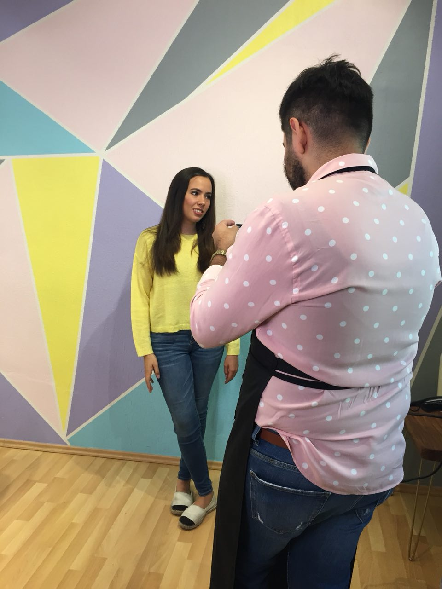
Ahora, nos toca a nosotras traspasar esta experiencia offline al e-commerce del estudio y no solo contentar a nuestro cliente; sino encontrar lo que Hair by Ricksou es lo que realmente necesita para entrar al fiero negocio de las ventas online.

## HIPÓTESIS   :sparkles:

 - Para “Hair by Ricksou" nuestro producto resuelve a las clientas del estudio el problema de agendar y comprar productos recomendados por su peluquero de confianza, dándoles un e-commerce. Sabemos que nuestro producto funciona cuando logremos un proceso ágil de citas y que las clientas puedan tener su producto sin salir de casa.

 - Para “Hair by Ricksou” nuestro producto resuelve a las mujeres mayores de 20 y menores de 40 para agendar por primera vez en un estudio profesional, dándoles un e-commerce. Sabemos que nuestro producto funciona cuando logremos un proceso ágil de citas.

 - Para “Hair by Ricksou” nuestro producto resuelve a las clientas del estudio el problema de que cuando necesitan un producto y no les alcanza, posteriormente tengan que regresar al local a comprarlo, dándoles un e-commerce. Sabemos que nuestro producto funciona cuando logremos una conversión de los productos.

## PROCESO DE INVESTIGACIÓN   :page_with_curl:

Métodos que usamos:

Para esta investigación decidimos acercarnos a los siguientes métodos de investigación:

- Entrevista al cliente

- Entrevista con usuario

- Observación contextual

- Inventario de contenidos

- Flujo de contenidos

- Benchmark

- Card Sorting

- Sketching
- Wireframe de alta 

### Entrevistas:

#### Insights de la entrevista con el cliente:

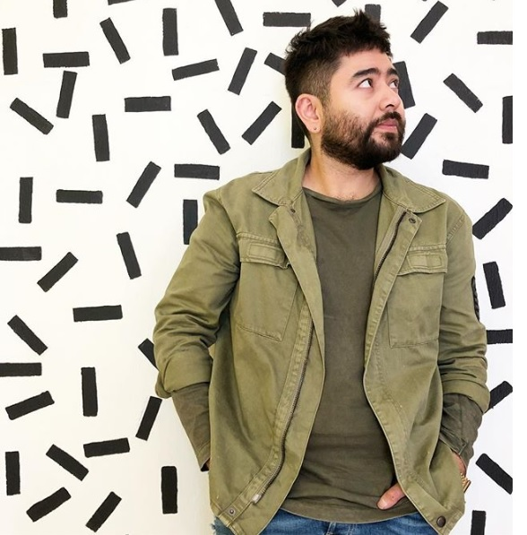

La entrevista con nuestro cliente fue muy importante ya que nos dimos cuenta de la misión, visión de Rick sobre su negocio.

 Rick quiere crecer profesionalmente, pero sin perder su esencia. También quiere apoyarse en una tienda en línea para proporcionarle a sus clientas la comodidad de recibir sus productos en la comodidad de sus casas o lugares del trabajo u agendar citas via e-commerce para agilizar.
 
 Con esto decidimos crear una interfaz sencilla; visualmente limpia y elegante. Para ayudar a Rick con la parte de las citas diseñamos un apartado donde la usuaria a través de 3 sencillas preguntas podrá saber un aproximado de cuánto le costaría un trabajo en el estudio y si lo desea poder concretar la cita.

 #### Insights de la entrevista con las usuarias:
 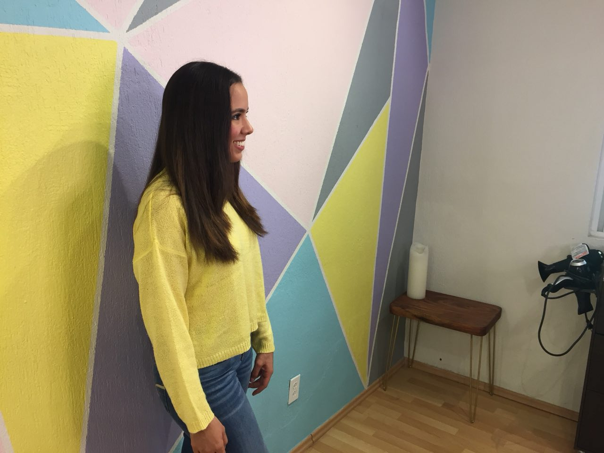
Aunque la entrevista con nuestro cliente fue muy enriquecedora, donde realmente encontramos mucho material para analizar fue con las entrevistas realizadas a las clientas. 

De estas entrevistas sacamos los siguientes puntos:

Las mujeres que por primera vez se enteran del estudio es por el boca en boca, su siguiente paso a dar es buscar las redes sociales, principalmente Instagram ya que es la más activa, al ver su trabajo e interesarse en este en la misma red social buscan contactarse con él.

Sabiendo esto decidimos hacer el e-commerce mobile first.

Otro punto importante que pudimos rescatar de las entrevistas fue que las usuarias querían una manera más eficaz de recoger un producto que por x o y razón no pudieron llevarse en su visita al estudio.

Este punto fue fácil de resolver ya que para esto se está creando el e-commerce.

#### Observación contextual:
 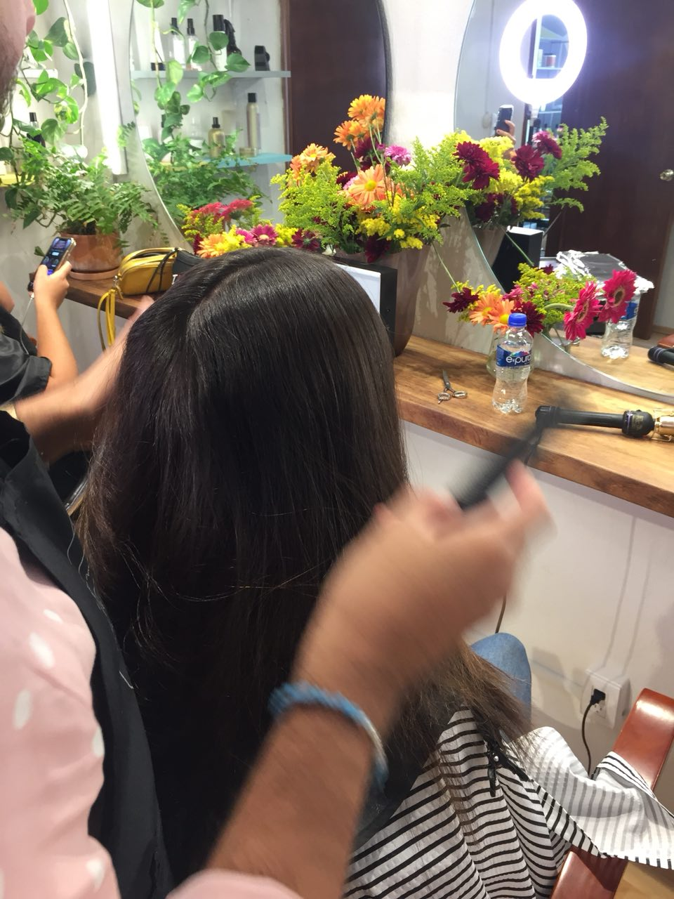
- En la observación contextual los insights más importantes fueron:

- Solo se atienden mujeres.

- La mayoría de las nuevas clientas llegan a este estudio por recomendación o por Instagram.

- La mayoría de las clientas regresan con Rick ya que en su primera visita les encantan los resultados.

- El trato a las clientas es amable, cordial.

- Rick se toma su tiempo para entender las necesidades de la clienta.

- Hay productos en exhibición, pero es pequeño el stock.

- Las clientas por lo general están dispuestas a pagar los productos que les recomienda Rick.

- A las clientas están dispuestas a regresar a comprar determinado producto, pero preferirían que se les enviara.

- Las citas son agendadas por Rick y por el staff.

- Para agendar las citas Rick se ayuda de Google Calendar y una libreta, así como de Whatsapp.
 
### Inventario de contenidos:
Nuestro sitio tendrá 2 vertientes principales: La venta de productos en las cuales se incluirán la descripción del producto, las reseñas de las usuarias, el precio y en algunos productos ( esto se llevará acabo en un segundo alcance) un video tutorial de cómo aplicar el producto conducido por el propio Rick.

La otra sección sería la de cotización y citas, este apartado será un formulario dividido en tres partes: elegir el tipo de servicio que se requiere, tipo de cabello y si se tiene algún proceso en el cabello.

Una tercera sección es el de un blog donde Rick contará la historia de una clienta y como su intervención en su cabello ayudó a dicha mujer. (esta sección aún se encuentra en proceso, por lo que no será mostrada en la demo)

### Flujo de Usuarios
Para este primer avance se decidió mapear el flujo de dos procesos del e-comerce: cotizar y sacar cita, y comprar productos.
 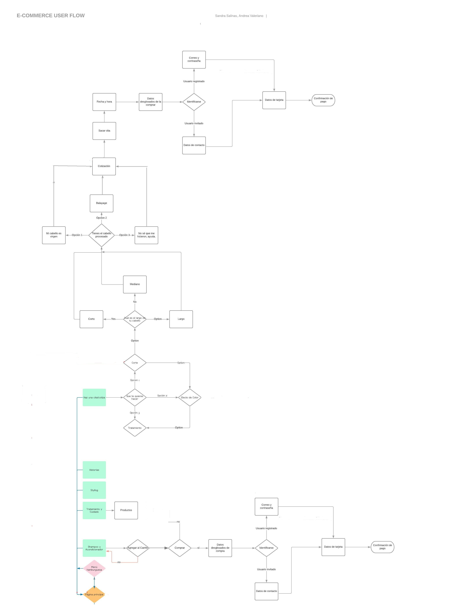

### Chart Flow
Para este primer avance se decidió hacer el chart flow el flujo de dos procesos del e-comerce: cotizar y sacar cita, y comprar productos.
 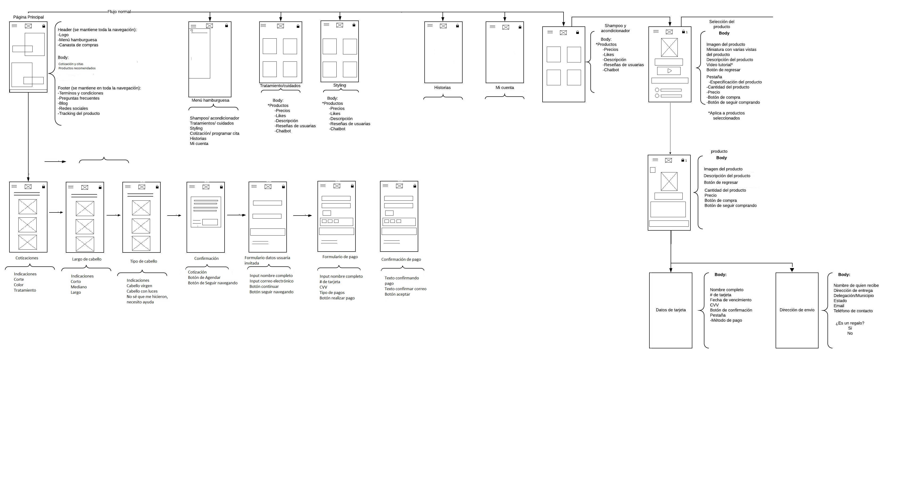
### Card Sorting
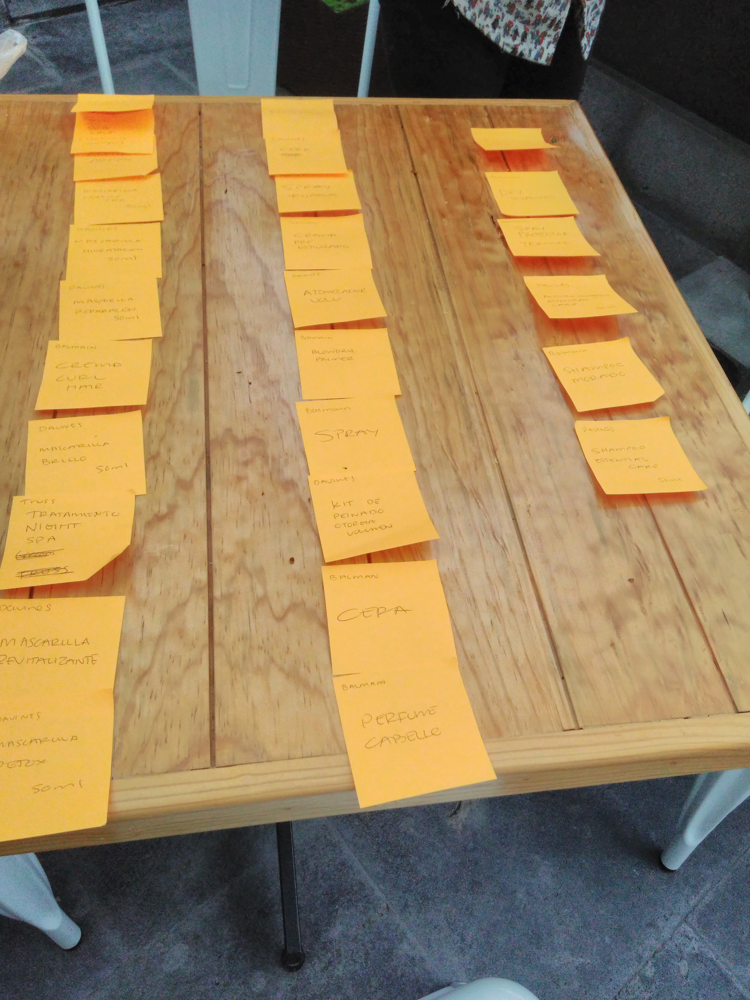
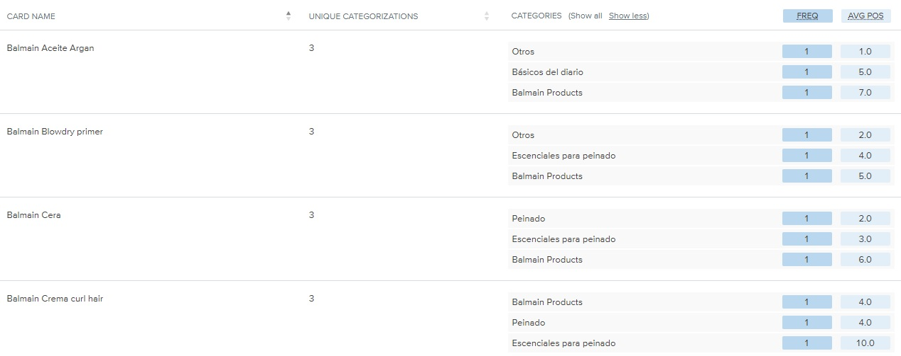
El card sorting se realizó con varias chicas que han usado los servicios de Rick o de otros estudios con características similares a las de nuestro cliente (precio, zona, tipo de servicio).

3 fueron realizadas vía internet y 1 fue realizada en persona.
Con la información recabada con este método de investigación decidimos agrupar el sitio de la siguiente manera: 
- Cotizaciones y citas
- Shampoo y acondicionador
- Estilizado de cabello
- Tratamientos
- Historias
- Mi cuenta

###  [Benchmark](https://drive.google.com/open?id=1Y8di3qV68CPMSPwzGi8AVgM5LgoLmAVP) 
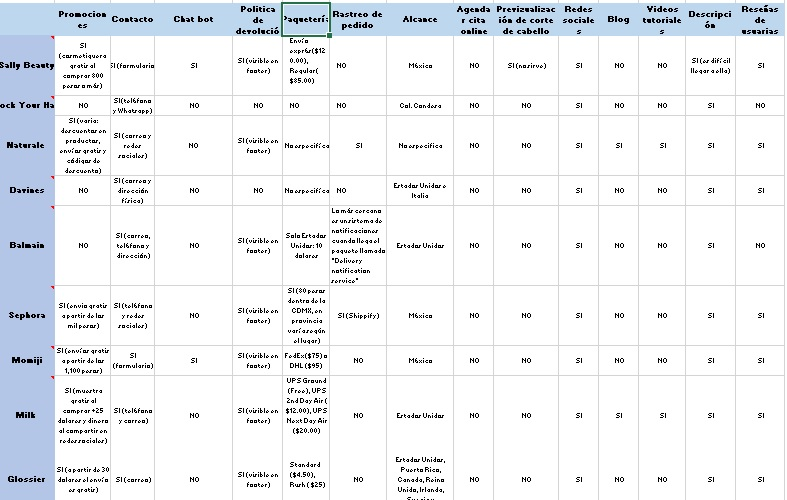

Para el benchmark decidimos buscar otros e-commerce con características relacionadas al servicio con el cliente, la logística de los envíos, la interacción de las usuarias con la página, y si la página muestra cómo se usan los productos que venden.

Comparamos tanto e-commerce que se dedican exclusivamente a la venta de productos para el cabello; exclusivamente maquillaje, aunque también tiendas que venden ambos productos y por último, una página de un estudio que es competencia de nuestro cliente.

Para esto analizamos los siguientes e-commerce: Sally Beauty, Rock Your Hair (no es un e-commerce, pero es competencia directa de nuestro cliente), Naturale, Davines, Balmain, Sephora, Momiji, Milk y Glossier.

  Con la comparación de estas 9 marcas nos dimos cuenta que muchas no priorizan la comunicación con las clientas. Solo 2 e-commerce (Sally Beauty y Momiji) y aunque todas cuentan con redes sociales la mayoría se encontraban en el footer.

Las cuestiones legales en todas se encontraban en el footer.

Haciendo el benchmark descubrimos varias áreas de oportunidad que podríamos atacar como son: que las usuarias puedan hacer una cotización vía el e-commerce; así como agendar una cita; incluir un apartado donde las usuarias puedan hacer un rastreo de su paquete(se prepara para un segundo alcance), incluir un blog donde nuestro experto comparta historias para empoderar a sus clientas (se prepara para un segundo alcance) y por último, pero no menos importante: incluir videos tutoriales (no de todos los productos, pero se podría hacer una selección del producto del mes. Esta parte se está preparando para un segundo alcance).

Creemos firmemente que estos puntos harán que el e-commerce de Rick  sobresalga de la mayoría de los ya existentes.

### Sketching
Empezamos creando unos sketchs muy sencillos en post-its, los cuales fueron cambiando lentamente mientras haciamos la investigación.
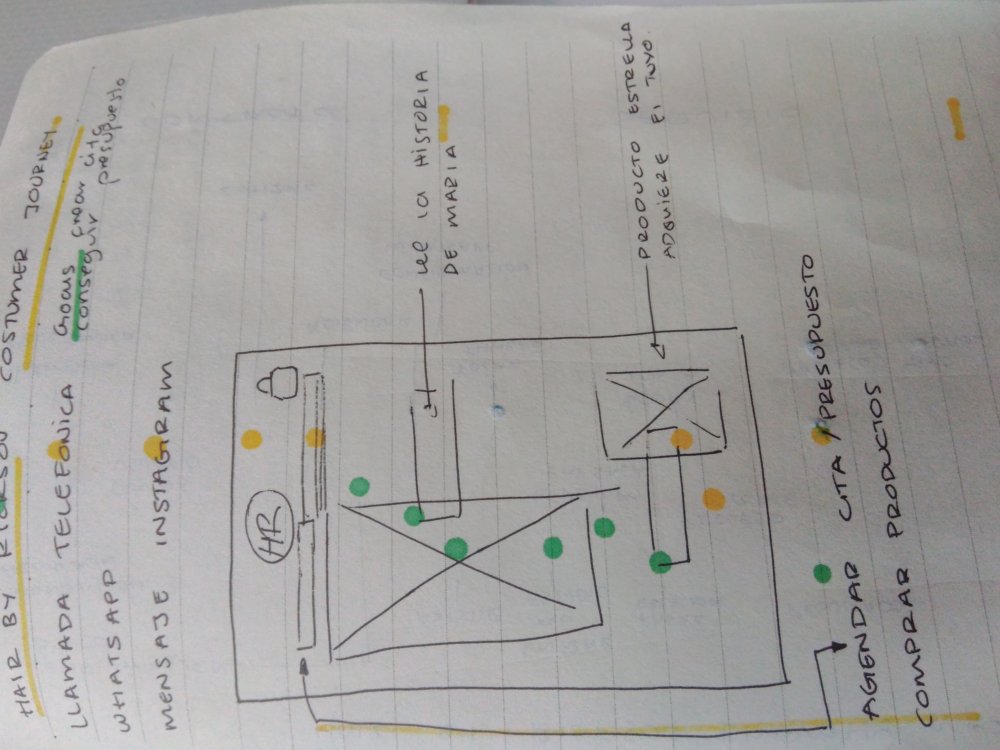
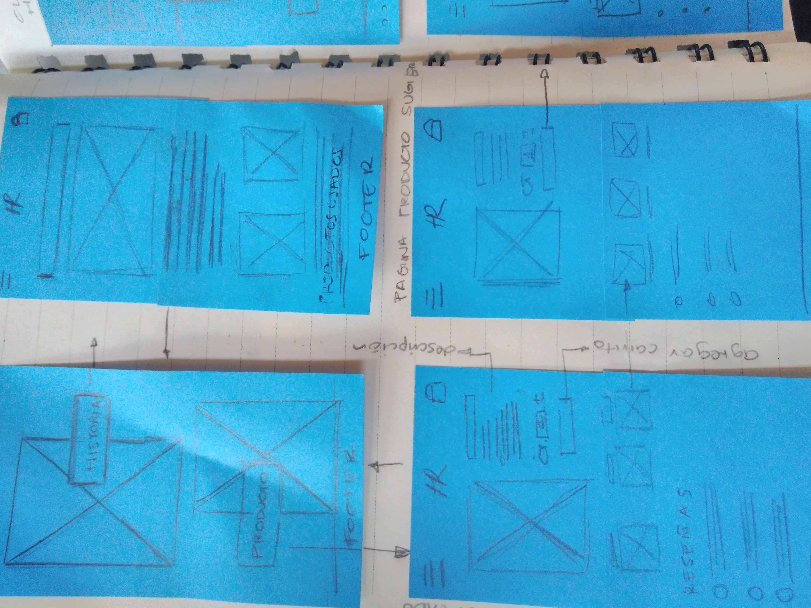
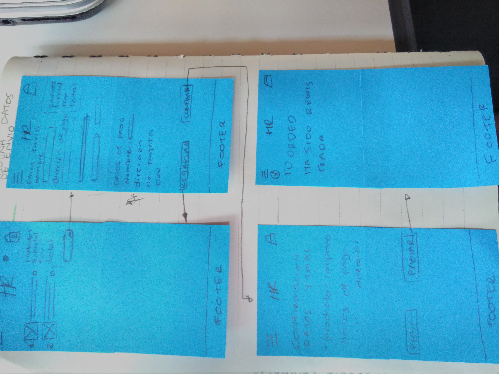

Al terminar la investigación y al sacar los insights nos dimos a la tarea de hacer un prototipo de baja y cliqueable.
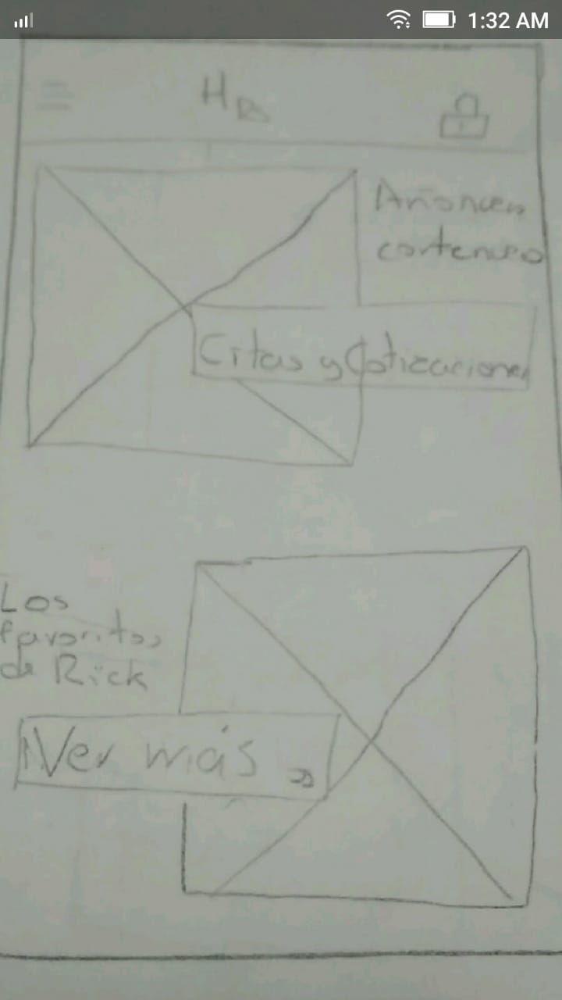
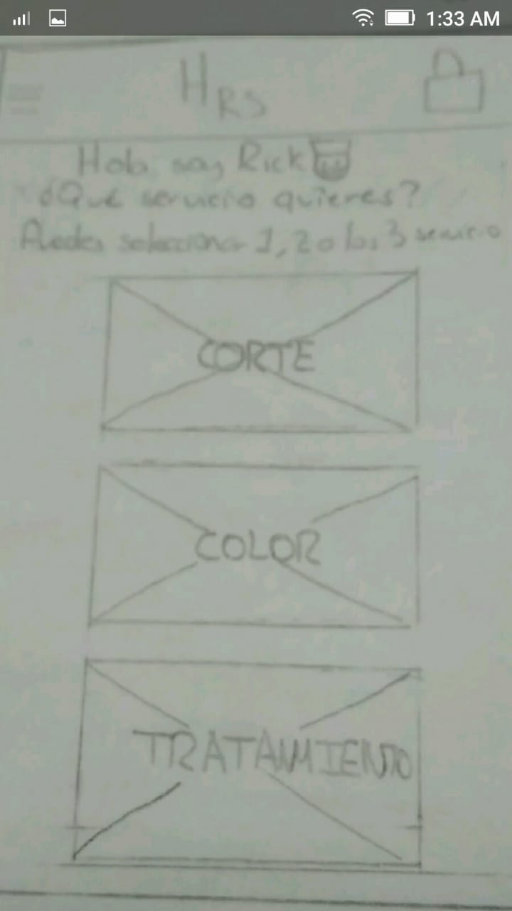
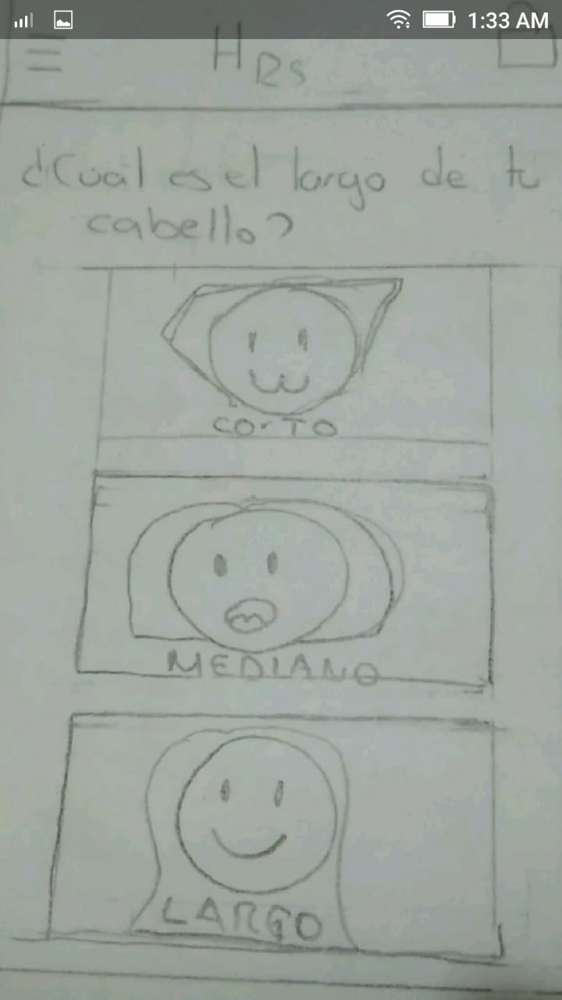
Al hacer pruebas con usuarias nos dieron varios feedbacks, pero el más importante fue el de la vista donde se le avisaba a la clienta que para apartar la cita tendría que hacer un depósito de la mitad del estimado.

Al principio creíamos que esto resolvería uno de los pain points que descubrimos en el journey map, pero nos dimos cuenta que era todo lo contrario. Por lo que decidimos omitir la parte del pago y darle la posibilidad de apartar la cita sin necesidad de desembolsar dinero por adelantado, además de que se planea mandarle de forma automática dos correos: el primero se haría cuando se hace la cita (con la posibilidad de que ese evento se agregue al calendario de la usuaria) y otro de recordatorio dos días o un día antes de su cita (dependiendo con cuanto tiempo hizo la cita).

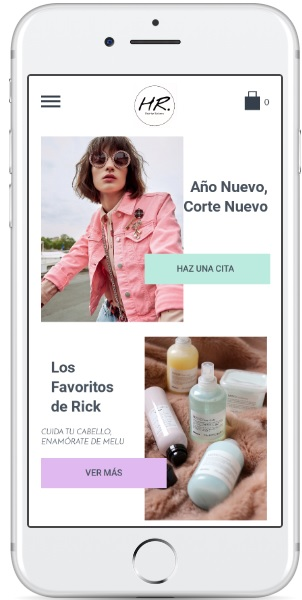

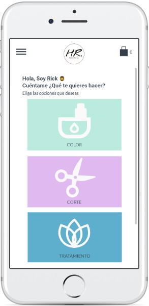

#### Prototipo de baja fidelidad
A continuación se encuentra el link al[Prototipo de baja fidelidad con interacción](https://marvelapp.com/34ei000).
#### Prototipo de alta fidelidad
A continuación se encuentra el link al[Prototipo de alta fidelidad con interacción](https://marvelapp.com/1924c2b6).
#### USER PERSONA

Nuestra User Persona fue mutando poco a poco. Pasó de ser una persona un tanto irreal a ser una persona que se acercaba más a la media de las clientas del estudio.

Primera iteración de la User Persona:
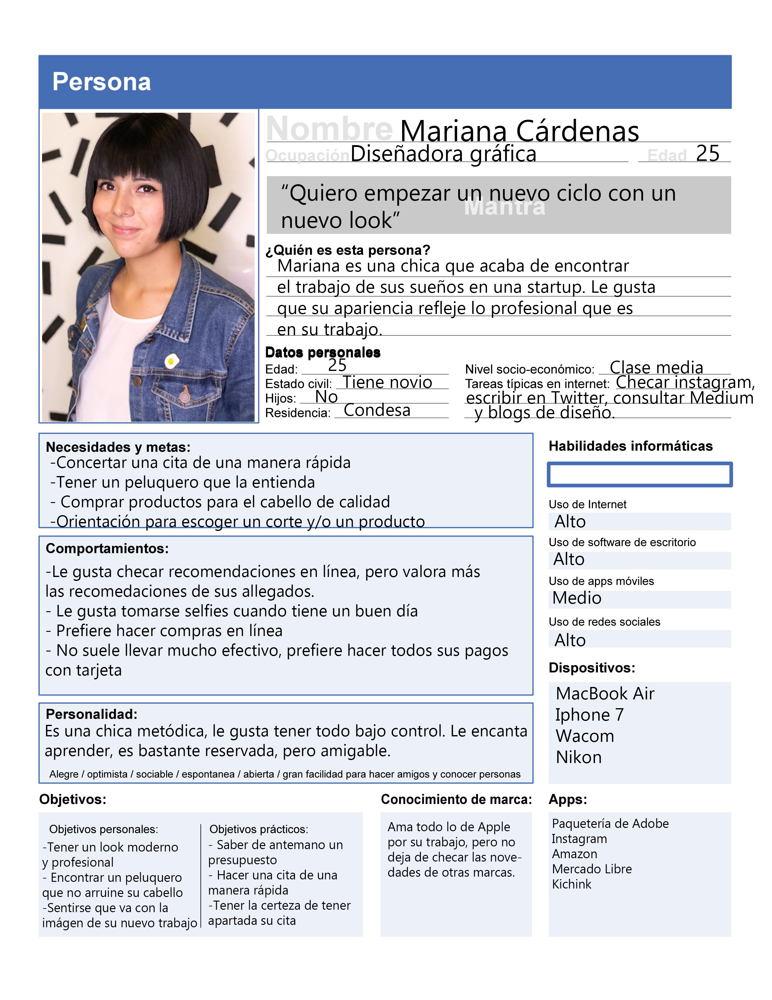
Segunda iteración de la User Persona:
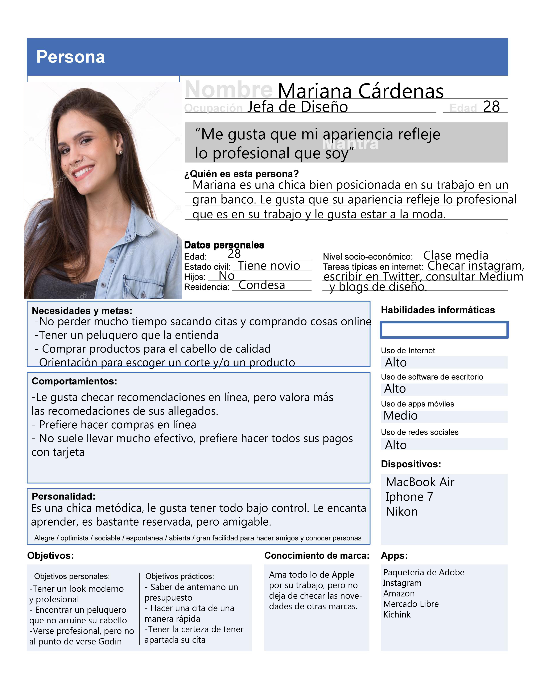
Aún sabemos que falta mucho para acercarnos a una User Persona más apegada a la data, pero hemos podido darnos cuenta de la importancia de tener a la User Persona en nuestras mentes mientras diseñábamos la interfaz del e-commerce.

#### COSTUMER JOURNEY

Decidimos hacer dos costumer journey para empatizar con las usuarias. Escogimos un proceso offline y otro online que a nuestro parecer eran los más importantes: sacar cita por primera vez(offline) y comprar productos (online).
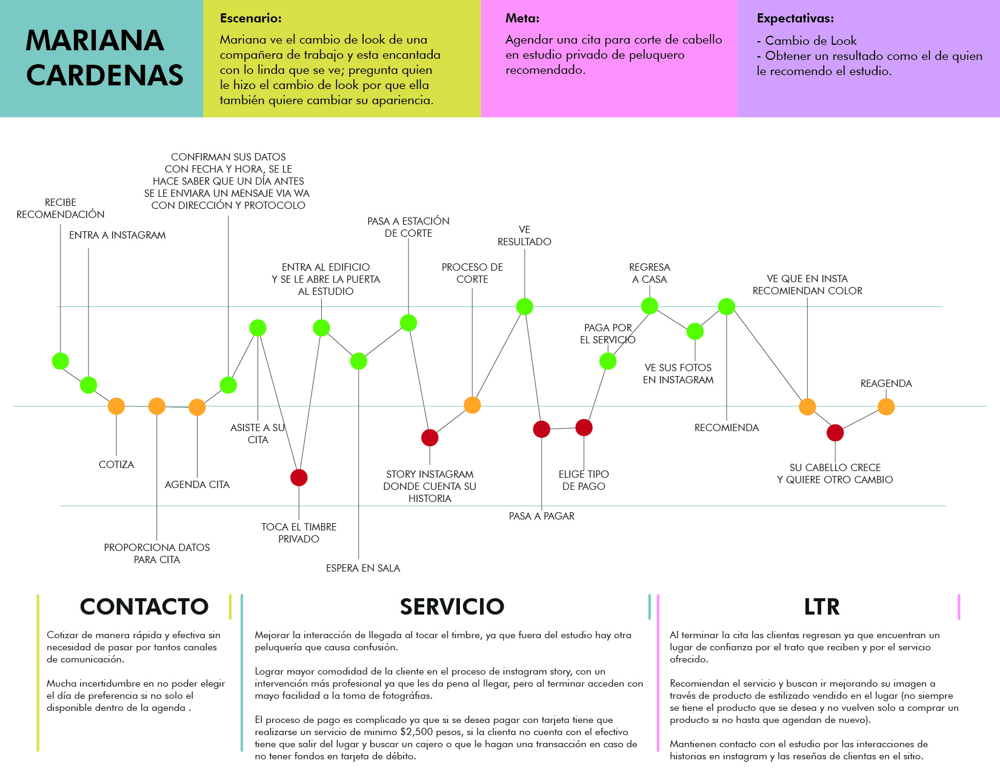
Con el primer costumer journey encontramos varios puntos de dolor. Por el momento decidimos enfocarnos en el punto de dolor de hacer una cita y el otro punto en el que nos enfocamos fue cuando por cualquier razón la clienta no puede llevarse un producto, tiene que regresar por él.

Estos fueron los dos pain points que decidimos solucionar para este primer alcance.
#### VIDEO EN LOOM
En este [Video en Loom](https://marvelapp.com/1924c2b6) les contamos a grandes rasgos nuestro proceso en este proyecto.
#### Presentación DEMO
Pueden checar la [presentación aquí](https://marvelapp.com/1924c2b6)

#### [ANEXOS](https://drive.google.com/open?id=1Y8di3qV68CPMSPwzGi8AVgM5LgoLmAVP)

Debido a la cantidad de audios y videos que se pudieron extraer tanto de las entrevistas como de la observación contextual aún se encuentran en proceso la transcripción de dichos archivos, a continuación, se transcriben los insights puntuales que se extrajeron de las entrevistas

Min 2:02

Entrevistado: (…)yo tener mi espacio, mi identidad, hacer cosas que si me gustaran y cosas que no me gustaran respetando a lo mejor la fórmula, pero también respetando lo que yo quería.

Entrevistadora: ¿Cuál crees que es la identidad de tu negocio?

Entrevistado: Siento yo que se basa en tres cosas, tal vez, una es la honestidad, la otra pues la creatividad y la técnica, totalmente. Yo he estudiado un montón así que la técnica que he aprendido en un lugar y en otro y en otro, cosas que he observado han tomado el conocimiento que ahora tengo, yo creo que eso es.

(…)

Min 3:00

Entrevistadora: ¿Cómo te das a conocer? Porque veo que afuera no hay ningún letrero ni nada.

Entrevistado: yo creo Qué es boca a boca. Yo creo que es la mejor recomendación es el boca a boca, como segunda fuente está Instagram porque en realidad no le invierto tanto tiempo le invierto a mis redes sociales. Mi mayor publicidad es el boca en boca. Entonces vienen y dicen “me corté el cabello con tal persona que me recomendó mi prima” y ya después de que lo recomendaron ¿cómo ratificas que es verdad lo que ella dijo?  ya vieron por medio de Instagram y pues ya se va haciendo una cadenita, van pasando la fuente y eso pero en realidad es boca a boca.

Entrevistadora: yo como cliente nueva ¿cómo te contacto?

Entrevistado: Instagram

Entrevistadora: Pero ¿la mayoría la cita son a través de porque medio es?

Entrevistado: WhatsApp

(…)

Min 4:47

Entrevistado: Yo soy medio bruto para la tecnología, ósea yo, soy medio torpe para la tecnología, creo que si fuera algo que estuviera muy filtrado y tuviera ciertas cosas, parámetro sería fácil, pero si (inaudible) análisis me costaría mucho trabajo.

Entrevistadora: ¿Qué parámetro tú considera que serían los más importantes para poner de manera digital?

Entrevistado: Una mini consulta, que no la haga yo, pero que sea muy interactivo, que es lo que le gusta a la gente, ósea que sea interactivo para que también sientan que están hablando conmigo.

(…)

Min 5:54

Entrevistadora: ¿Cómo te ves a ti en 5 años?

Entrevistado: En un lugar mucho más grande…pero lo que sí sé que no quiero es el concepto de un salón de belleza, eso no quiero. Lo que quiero es un lugar más grande donde cada cuarto que haya sea un espacio para una persona y su asistente, así me veo y me veo como un gurú del cabello y creo que en plataformas como YouTube.

Entrevistadora: ¿Haciendo tutoriales?

Entrevistado: Algo así, sí, si tengo la idea de hacer algo así o como un agente de cambio.

Entrevistadora: Que cool.

(…)

Min 7:41

Entrevistado: Esta salón, por lo menos mi estudio está diseñado en base a mis gustos y eventualmente si pienso en las clientas, pero pienso más en qué quiere ***, ¿cómo le gustaría ser atendido ***? No voy dirigido a un cierto sector social en general, es algo que no me gusta profundizar en eso, más bien voy para las personas que quieran un cambio y así.

Entrevistadora: ¿Tienes un aproximado de mas o menos la edad?

Entrevistado: Si, 20 años a 55.

Entrevistadora: Es bastante amplio.

Entrevistado: Tengo 3, 4 clientas que andan en los ochenta años.

Entrevistadora: Mas o menos a grandes rasgos me puedes decir ¿qué es lo que ofreces?

Entrevistado: ¿Qué ofrezco?

Entrevistadora: Tus servicios.

Entrevistado: Por lo general que el color y el corte y como que no pueden vivir la una sin la otra y todos los colores siempre tienen que llevar tratamiento. Entonces, color, corte y tratamiento.

Entrevistadora: ¿Con qué frecuencia tendría que venir alguien… Osea, vengo yo y me hago un color ¿Cuándo tendría yo que venir?

Entrevistado: Cada mes y medio, dos meses cuando máximo.

Entrevistadora: ¿Y se puede hacer el mismo proceso de decolorado o cambia el servicio que me vas a dar?

Entrevistado: No, cambia, cambia según las necesidades que tenga tu cabello en ese momento.

Entrevistadora: Mas o menos ¿en cúanto está ese servicio?

Entrevistado: Varía según el largo, la cantidad…(9:48)

Entrevistadora: podemos decir que el promedio de la mujer mexicana es más o menos más o menos largo…. como en cuanto sale tratamiento

Entrevistado: Mediano.

Entrevistadora: Mediano. ¿Más o menos en cuánto sale un tratamiento?

Entrevistado: Un tratamiento ¿o todo?

Entrevistadora: Todo.

Entrevistado: Pues digamos que el corte es de 650, el tratamiento desde 300 y el tinte desde los $2,500 pesos.

Entrevistadora: ¿Vendes aquí productos, productos de cuidado del cabello, o nada más los que usas para peinar?

Entrevistado: Si vendo productos como para mantenimiento, pero tengo una gama, ¿Cómo se dice? Mínima.

Entrevistadora: ¿Qué tanto te compran? O ¿no les interesa?

Entrevistado: Pues como 60 compran y 40 no compran. Y es porque lo recomienda el estilista.

Entrevistadora: ¿Tienes inventario de producto?

Entrevistado: No

Entrevistadora: ¿ Y por qué no tienes un inventario? Tratas de tener uno, pero un inventario más grande no lo tienes ¿por?

Entrevistado: No me gustaría ,porque como es un negocio muy personal entonces no me gusta acumular cuentas ni deudas, por eso no tengo un stock tan alto de productos.

Entrevistadora: Y por ejemplo, clientas que vengan por un tipo de tratamiento, una mascarilla, pero no hay esa mascarilla ¿le avisas o qué sucede? O cuando ellas no pueden venir ¿te buscan?, ¿qué es lo que sucede después del “ahorita no tengo tal mascarilla”?

Entrevistado: Se les consigue.

Entrevistadora: ¿Le notificas de alguna manera?

Entrevistado: Se les manda un mensaje de “ya llegó la mascarilla” y se les manda.

Entrevistadora: ¿Se les manda por DHL o Rappi o por cuál servicio?

Entrevistado: Normalmente vienen a recoger o por Uber.

Min 12:34

Entrevistadora: ¿Cuáles son las 3 preguntas que le haces a una clienta que se quiere cortar el cabello?

Entrevistado: ¿Qué espera de su cabello?, ¿Qué no le gusta de su cabello? y ¿qué quisiera de su cabello?

MIN 13:01

Entrevistado: Siempre trato de entablar una conversación y después tratar de analizar a esa persona y ver si le queda o no según sus características físicas y con base a eso ya es el resultado.

Entrevistadora: ¿Eso siempre lo haces presencial?, ¿o lo haces por algún medio, por ejemplo, por teléfono?

Entrevistado: Si me mandan la foto me enfoco solamente en el costo que es a lo que la gente le interesa saber y ya aquí es completamente otra parte, porque cambia ver a la persona enfrente, pero por lo general, cuando me mandan la foto y así por lo general les pido fotos de referencia y fotos de ella sin retoque y ya les digo, porque la gente quiere saber cuánto puede gastar y saber si se acerca a su posibilidad económica.

Entrevistadora: ¿Con qué frecuencia te cancelan las chicas?, ¿y de qué manera te cancelan?

Entrevistado: Un 20%, tampoco es tanto.

Entrevistadora: ¿Y a través de que medio?

Entrevistado: Whatsapp o no avisan.

Entrevistadora: Osea, yo saco una cita contigo y ya quedamos y me vuelves a hacer una confirmación vía ¿correo electrónico?

Entrevistado: Vía Whatsapp.

Entrevistadora: Entonces yo ya te contesto y ya quedamos.

Entrevistadora: ¿Tú que sientes cuando las chicas no te avisan que no van a venir?

Entrevistado: Pues que es muy informal, eso se me hace mal porque hay chicas que si quieren venir y se me hace mal restarles importancia a las demás personas. Conmigo no tengo ningún problema porque al final sé que voy a tener trabajo, pero si creo que hay chicas que se quieren ver bonita para un sábado para una comida y a la mejor no lo lograron porque encontraron ocupado el espacio y a lo mejor no vino esa persona.

Se me hace como mal. Yo sé que la chava que quiere conmigo se va a esperar de aquí a tres meses y no va a tener broncas. Pero se me hace muy irresponsable.

Entrevistadora: Y digamos. Una clienta saca una cita y no viene y te vuelve a pedir otra cita y no vuelve a venir.

Entrevistado: Cuando pasa eso les pido un anticipo. Ya no confiamos en ellas, se pone una notita de que canceló cita o algo así y ya se le pide un anticipo después.

Entrevistadora: Tienes una especie de registro de las que te cancelan. ¿Ese registro dónde lo tienes?

Entrevistado: A mano. Lo tengo en un block.

Entrevistadora: ¿Hay más personas que tienen acceso a tus citas?

Entrevistado: Si, las puede checar cualquiera del staff.

MIN 17:00

Entrevistadora: ¿Por qué alguien elegiría un spray sobre una cera?, ¿cómo se dan cuenta ellas de qué quieren?, ¿es a través del empaque, del trabajo?

Entrevistado: Del resultado del producto.

Entrevistadora: Y este resultado ¿tú las peinas?

Entrevistado: Ese resultado yo se los muestro a través de su cabello (…) a final de cuentas el que le da poder al producto soy yo.

Entrevistadora: ¿Le vendes producto a chicas que no sean tus clientas? Por ejemplo, vi en Instagram que peinaste a alguien super chido y te pregunto “oye, tu tenaza”, “oye ¿qué producto usas?, ¿me lo vendes?”, ¿o es exclusivo para tus clientas?

Entrevistado: Es solamente para mis clientas.

Entrevistadora: ¿Con una tienda en línea no te gustaría vender más de esos productos?

Entrevistado: Estaría bien, pero siento que a mi, Rick, estaría más (…) tendría que tener un manual de cómo usar ese producto (…) siento que el producto va a tener ese valor si yo le doy el poder al producto. No creo que un producto se venda por si solo (…) si yo voy a tener un e-commerce tiene que ser uno muy interactivo.

-------------

Entrevistada: Dije “si ya está aquí me lo llevo”, pero si no voy a pedir uno por Amazon.

(…)

Entrevistadora: ¿Normalmente lo compras online?

Entrevistada: Si, últimamente lo compro online, antes lo compraba en un salón que se llama Contraste que está sobre Álvaro Obregón (…)

Entrevistadora: ¿Si compras normalmente en línea?

Entrevistada: ¿Yo? Si, antes no, pero mi esposo que es todo práctico…

Entrevistadora: Te incursionó en el mundo

Entrevistada: Si. No es como que compre ropa y zapatos en línea, pero shampoos, libros, lentes de mi hija ya los compro en línea.

Entrevistadora: ¿Y los compras en Amazon?

Entrevistada: Amazon.

(…)

Entrevistada:

Entrevistadora: Antes compraba toda la línea (…) me compraba el shampoo, el acondicionador y el tratamiento, pero le he ido bajando. Ahora los niños ya toman gimnasia, natación…

Entrevistada: ¿cuántos años tienes? Te ves muy chiquita

Entrevistadora: 37, no estoy tan chiquita (…) los gastos siguen subiendo, pero los ingresos no.

(…)

Entrevistadora: Entonces, ¿los hijos hacen que dejes de invertir tanto en ti?

Entrevistada: Es que, wey, está cabrón.

Entrevistadora: ¿Cuántos tienen?

Entrevistada: 6 y 4

(…)

Entrevistadora: ¿Tú eres de aquí?

Entrevistada: No, soy de Guadalajara.

(…)

Entrevistada: Déjate tú el dinero; ya no tienes tiempo. Antes me ponía uñas postizas cada mes

Entrevistadora: Ya no.

Entrevistada: Era un pedo llegar a mi cita.

Entrevistadora: Y ¿ahorita te diste el tiempo? O ya tienes considerado…

Entrevistada: No, ya le había cancelado una vez (inaudible) cuando lo busqué para reagendar me dijo “voy a necesitar que me deposites algo para asegurar tu cita” y yo le dije “habrá manera en que la cambiemos” y dijo “no, no hay manera” y pues voy ,pero ahorita tengo un pedo tremendo, pero mira, todo sale.

(…)

Entrevistadora: Ahora eres presupuesto que gastabas en tal cosa, ahora supongo que priorizas. A lo mejor la salud de tu hijo a zapatos…

Entrevistada: Y sobre todo que dices, igual a que te caiga el dinero, nunca sabes que improvisto va a haber. Es un chingo de lana y no por que te esté yendo bien significa que te lo puedes gastar porque no sabes que improvisto va a haber, ósea.

Y por otro lado, no hay dinero que te sobre con los niños.

