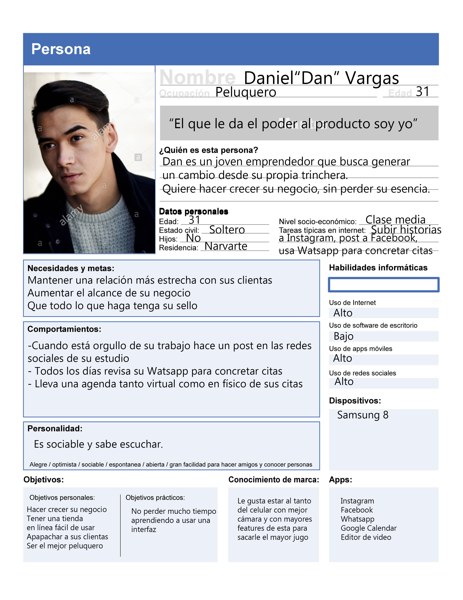
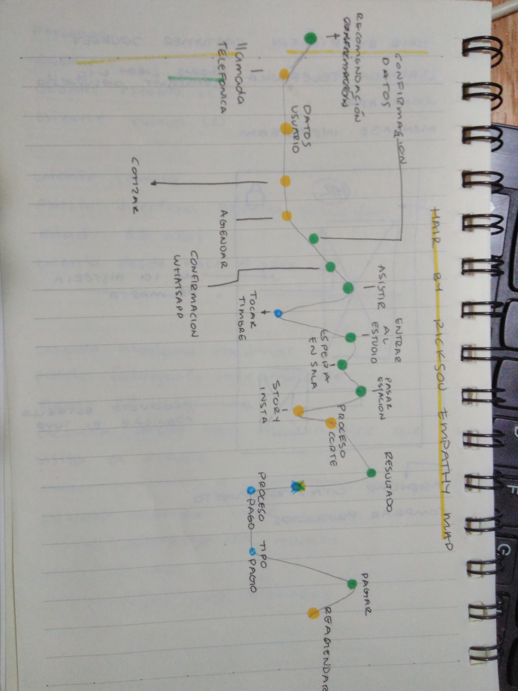
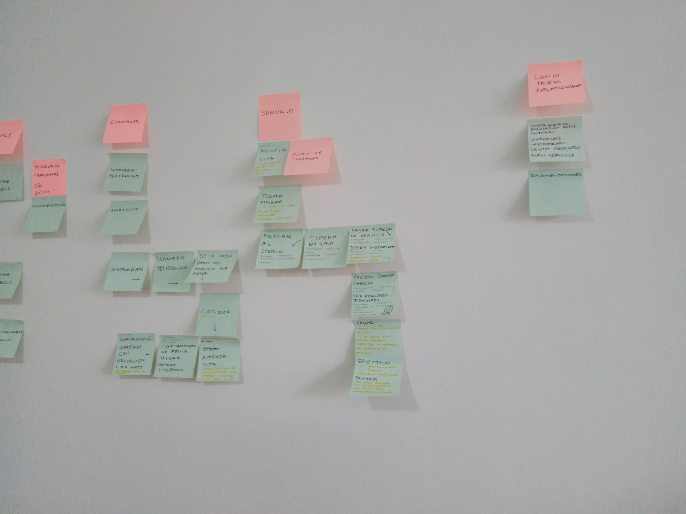

# E-commerce para el estudio "Hair by ****

## INTRODUCCIÓN

En esta ocasión estamos en la creación de un e-commerce para el estudio “Hair by ******”, cuya ubicación se encuentra en *******, colonia ******.

Dicho estudio se especializa en darle a sus clientas la mejor atención, así como el corte de sus sueños. Asegurándose una alta fidelidad por parte de sus clientas.

En estos tiempos modernos el dueño se ha dado cuenta que entrar al mundo de las ventas en líneas posiblemente le ayudará a crecer su negocio y a consolidar su estudio como uno de los mejores.

## HIPÓTESIS

-Para “Hair by *******” nuestro producto resuelve a las clientas del estudio el problema de agendar y comprar productos recomendados por su peluquero de confianza, dándoles un e-commerce.

Sabemos que nuestro producto funciona cuando logremos un proceso ágil de citas y que las clientas puedan tener su producto sin salir de casa.

-Para “Hair by *******” nuestro producto resuelve a las mujeres mayores de 20 y menores de 40 para agendar por primera vez en un estudio profesional, dándoles un e-commerce.

Sabemos que nuestro producto funciona cuando logremos un proceso ágil de citas.

## USER PERSONA
Para empezar a empatizar con los procesos que se llevan a cabo en el estudio de belleza y también para empezar a condesar la información obtenida nos dimos la tarea de crear a dos User Persona.
La primera ejemplifica a nuestro cliente, mientras que la segunda es de una clienta nueva del estudio. 

## COSTUMER JOURNEY
Habiendo hecho las User Persona nos dedicamos a hacer el Costumer Journey de la clienta que visita por primera vez el estudio.
Primero lo hicimos en papel, luego en post-its y por último lo hicimos en digital.

## PROCESO DE INVESTIGACIÓN

### Métodos que usamos

En este primer alcance se decidió trabajar con los siguientes métodos de investigación:

#### -Entrevista al cliente (25 pts)

#### -Entrevista con usuario (60 pts)

#### -Observación contextual (35 pts)

#### -Inventario de contenidos (15 pts)

#### -Flujo de contenidos (15 pts)

#### -Card Sorting (15 pts)

#### -Sketching (30 pts)

De todos estos métodos solo no pudimos usar el flujo de contenidos y el card sorting, esto se debió al poco tiempo y cierta restricción para acceder al estudio.

Pero dentro de estos métodos en esta primera etapa sacamos una gran cantidad de información por parte de las entrevistas.

### Insights que sacamos de cada uno

#### Entrevistas:

La entrevista con nuestro cliente fue muy importante ya que nos dimos cuenta de la misión, visión de **** sobre su negocio. 
En esta descubrimos que el cliente considera importante el e-commerce para darle un mayor alcance a su marca.
También le es de suma importancia que su sello tanto visual como en servicio al cliente se vea reflejado en la interfaz.
Quiere que sus clientas se sientan acompañadas en todo momento durante la visita en el e-commerce.

#### Observación contextual:

En la observación contextual los insights más importantes fueron:

 - Solo se atienden mujeres.

- La mayoría de las nuevas clientas llegan a este estudio por recomendación o por Instagram.

- La mayoría de las clientas regresan con **** ya que en su primera visita les encantan los resultados.

- El trato a las clientas es amable, cordial.

- **** se toma su tiempo para entender las necesidades de la clienta.

- Hay productos en exibición, pero es pequeño el stock.

- Las clientas por lo general no traen más dinero para comprar productos.

- A las clientas están dispuestas a regresar a comprar determinado producto, pero preferirían que se les enviara.

- Las citas son agendadas por **** y por el staff.

- Para agendar las citas **** se ayuda de Google Calendar y una libreta.

#### Inventario de contenidos:

Haciendo el inventario de contenidos llegamos a 3 grandes servicios que ofrece el estudio:

Servicios de corte: En este una puede pedir un corte de cabello, agregar color y darle mantenimiento al color, Se puede pedir unos de estos servicios o combinarlos.

Venta de productos: Los productos que ofrecen son de dos tipos: de cuidado y estilizado. Estos productos por lo general las clientas ven como los utiliza **** y entusiasmadas de lo que puede hacer en su cabello, lo solicitan al peluquero.
En algunos casos las clientas se llevan el producto y en otros regresan por el producto que les gustó o en último caso se contacta a un servicio de entrega de paquetes (por lo general Uber).

Cotización: El último servicio es el de cotización. Este solo consiste en que **** tras una breve entrevista les da un aproximado a la clienta de cuanto le saldría un corte de cabello con él dependiendo del largo, si es natural o teñido y si está muy maltratado.

Sketching: Este método de momento no nos aportó mucho, pero nos ayudó a aterrizar ciertas ideas que creemos en un futuro nos podrían servir al momento de empezar a maquetar.

### ANEXOS

Se agrega la presentación al cliente: [Presentación](https://docs.google.com/presentation/d/1YbhD9El4PavAhZ_ozbKHO2faHanLQSUK7TmtAk4iDaI/edit?usp=sharing).

Debido a la cantidad de audios y videos que se pudieron extraer tanto de las entrevistas como de la observación contextual aún se encuentran en proceso la transcripción de dichos archivos, a continuación, se transcriben los insights puntuales que se extrajeron de las entrevistas:

###### Entrevista ********

Min 3:00
Entrevistadora: ¿Cómo te das a conocer? Porque veo que afuera no hay ningún letrero ni nada.
Entrevistado: yo creo Qué es boca a boca. Yo creo que es la mejor recomendación es el boca a boca, como segunda fuente está Instagram porque en realidad no le invierto tanto tiempo le invierto a mis redes sociales. Mi mayor publicidad es el boca en boca. Entonces vienen y dicen “me corté el cabello con tal persona que me recomendó mi prima” y ya después de que lo recomendaron ¿cómo ratificas que es verdad lo que ella dijo?  ya vieron por medio de Instagram y pues ya se va haciendo una cadenita, van pasando la fuente y eso pero en realidad es boca a boca.
Entrevistadora: yo como cliente nueva ¿cómo te contacto?
Entrevistado: Instagram
Entrevistadora: Pero ¿la mayoría la cita son a través de porque medio es?
Entrevistado: WhatsApp

Min 5:54
Entrevistadora: ¿Cómo te ves a ti en 5 años?
Entrevistado: En un lugar mucho más grande…pero lo que sí sé que no quiero es el concepto de un salón de belleza, eso no quiero. Lo que quiero es un lugar más grande donde cada cuarto que haya sea un espacio para una persona y su asistente, así me veo y me veo como un gurú del cabello y creo que en plataformas como YouTube.
Entrevistadora: ¿Haciendo tutoriales?
Entrevistado: Algo así, sí, si tengo la idea de hacer algo así o como un agente de cambio.
Entrevistadora: Que cool.
Min 12:34
Entrevistadora: ¿Cuáles son las 3 preguntas que le haces a una clienta que se quiere cortar el cabello?
Entrevistado: ¿Qué espera de su cabello?, ¿Qué no le gusta de su cabello? y ¿qué quisiera de su cabello?
Entrevistadora: ¿Tú que sientes cuando las chicas no te avisan que no van a venir?
Entrevistado: Pues que es muy informal, eso se me hace mal porque hay chicas que si quieren venir y se me hace mal restarles importancia a las demás personas. Conmigo no tengo ningún problema porque al final sé que voy a tener trabajo, pero si creo que hay chicas que se quieren ver bonita para un sábado para una comida y a la mejor no lo lograron porque encontraron ocupado el espacio y a lo mejor no vino esa persona.
Se me hace como mal. Yo sé que la chava que quiere conmigo se va a esperar de aquí a tres meses y no va a tener broncas.

